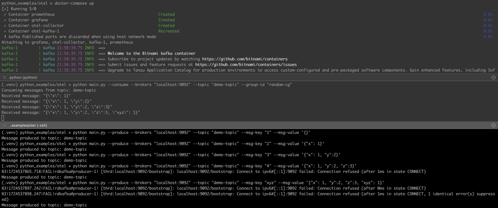
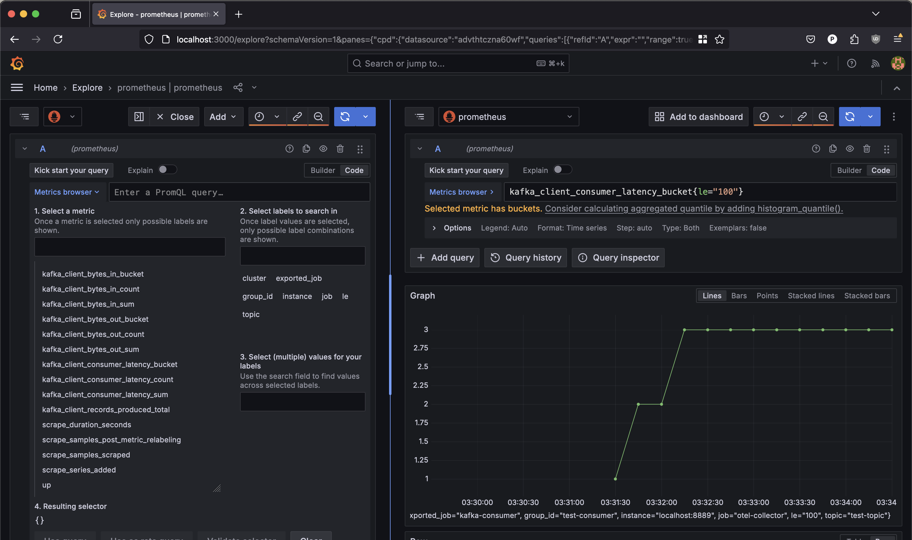

# Otel + Prometheus + Kafka
This is a POC on how otel works with prometheus in python application.


                
```
tldr:

application -> -- perodic push ---> otel collector (:4317 | :4318)
                                                otel_collector:8889 <--- prometheus(scraping)

```
----
```
* python application + otel sdk -> emits metrics periodically
* otel reader thread in application -> reads metrics -> export(call endpoint) periodically to otel exporter(receiver) on either grpc (port 4317) or http (port 4318)
* otel collector:
   receiver -> this is a grpc+http server which receives requests from python application

   now our metrics are present at otel collector container we have to pass it to prometheus

   there are two ways now:
   1. pull - let the prometheus scrape you (the collector)
     1a. configure a port and let the prometheus scrape you - this is what we have done. check prometheus.yaml
   2. push from collector to prometheus - `prometheusremotewrite` https://prometheus.io/docs/specs/remote_write_spec/
* now metrics has reached to prometheus and you can use grafana now


```


## Usage
```
python main.py --help
Usage: main.py [OPTIONS]

Options:
  --consume / --produce  Choose to consume from or produce to a topic
  --brokers TEXT         Kafka brokers, comma-separated
  --topic TEXT           Topic to consume from or publish to  [required]
  --auth                 Is auth required?
  --mechanism TEXT       Authentication mechanism (e.g., SCRAM-SHA-512)
  --username TEXT        username
  --password TEXT        password
  --msg-key TEXT         Kafka msg's key (for produce only)
  --msg-value TEXT       Kafka msg's value (for produce only)
  --help                 Show this message and exit.
```

## Setup

```sh
virtualenv -p /path/to/python3.8/bin/python .venv
source .venv/bin/activate
pip install -r requirements.txt
```

## Running
1. Start all the containers `docker-compose up`
2. Split your terminal and start producer and consumer separately
3. Open http://localhost:3000 and see the metrics

## Screenshots



